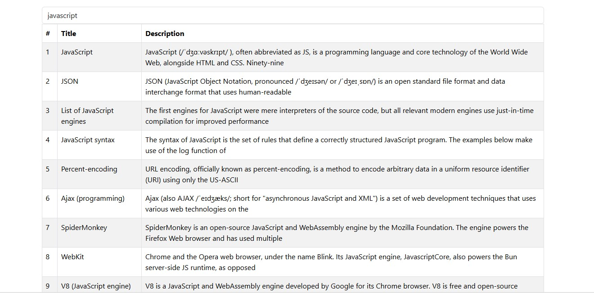

# Search-App-kimz

This is a simple project to learn and practice react"Hooks" and Debouncing technique and custom hooks. 

## Table of contents

- [Overview](#overview)
- [Installation](#Installation)
- [Usage](#Usage)
- [Links](#Links)
- [Screenshot](#Screenshot)
- [What I learned](#what-i-learned)
- [Author](#author)
- [Acknowledgments](#Acknowledgments)


## overview
This is a simple project to learn and practice react"Hooks" and Debouncing technique and custom hooks. 


## Installation
To get started with this project, follow these steps:

you can clone the project or download it as Zip file.
1. Clone the repository:
   ```bash
   https://github.com/olahasan/Search-App-kimz.git

2. Navigate to the project directory:
   cd <project-directory>

3. Install the required dependencies:
   npm install   


## Usage
To run the application, use the following command:

npm start


## Links

If you want to open the link in a new tab, you can:

- Press **Ctrl** (or **Cmd** on Mac) while clicking the link.
- Right-click the link and select **Open link in new tab**.

Otherwise, all links will open in the same tab.


- Solution URL: [here](https://github.com/olahasan/Search-App-kimz)

- Live Site URL: [here](https://search-app-kimz.surge.sh/) OR [here](https://search-app-kimz.netlify.app/)

 ## Screenshot
 



## What I learned
how to deal with Debouncing technique and custom hooks.

1- Debouncing technique
```
 const debounce = setTimeout(() => {
        // -- 1 -- Ensure that the term is not empty before making the request
        if (term) {
          //prevent first time fetching
          searchAPI();
        }
      }, 1400);
```

2- Custom Hooks 

```
import { useEffect, useRef } from "react";

const usePrevState = (currentState) => {
  const ref = useRef();
  const prevTerm = ref.current;

  useEffect(() => {
    ref.current = currentState;
  }, [currentState]);

  return prevTerm;
};

export default usePrevState;
```

### Author

GitHub - @olahasan

### Acknowledgments

I would like to thank the **[kimz codes](https://www.youtube.com/@kimzcodes)** for providing this challenge and for his support.


